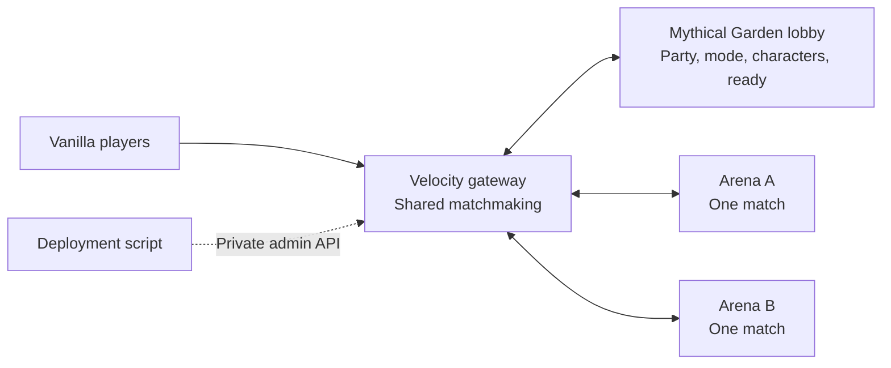

# Container network

The vanilla server now has a Velocity gateway, one Mythical Garden lobby and two independent arena workers. Players use ordinary Minecraft Java **26.2**, with no client mod or resource pack. Each arena runs one two-player duel, four-player free-for-all, or practice/sandbox session. The existing `PLAY.cmd` still runs the standalone prototype.



Velocity reserves an empty, healthy worker for the entire roster before moving anyone. It then asks the lobby to atomically claim the exact ready tickets; a concurrent cancellation or changed character prevents the transfer. A round starts only after every player reaches that worker. Each class selection travels with its reservation. Players return to the lobby after results or `/smash leave`. Incomplete public queues can wait while a free worker hosts training. Matchmaking excludes workers with stale HTTP responses or stalled game ticks.

`/smash join` opens a native Java dialog with 1v1, Free-for-all, Practice, and the party roster. Create/invite/accept/manage actions are buttons; the leader chooses the mode. Each member enters an isolated 3D character stage: scroll/1–5 changes the draft, right-click readies, and Q cancels the group's selection and returns to the match menu. Ready members see who is still choosing and can change their fighter. Only a fully ready group publishes tickets. Default appearances require no resource pack.

Tickets carry an indivisible group and mode. Matchmaking uses the oldest feasible combination of whole groups: two-person parties can duel each other, and smaller FFA parties fill with public players. A three-person party can wait for one solo without blocking another pair of two-person parties from playing. A lobby compare-and-claim prevents parties from being split or a cancelled selection from starting. Exact-ticket cleanup cannot erase a newer choice. Proxy presence preserves parties during backend transfers while removing disconnected members and promoting a new leader. Parties survive matches but are not persisted through lobby restarts.

## Start locally

Requirements: Docker with Linux containers, Docker Compose v2 or later, Python 3.11+ and Java 25 for building. Run these commands **from this `smash_vanilla` directory**. On Windows use `gradlew.bat` and your Python executable; on Linux use `bash gradlew` and `python3`.

```powershell
$env:JAVA_HOME = 'C:\Program Files\Java\jdk-25'
./gradlew.bat --gradle-user-home ../smash_arena/.gradle-user-home build containerArtifacts
C:/Python312/python.exe deploy/prepare.py --secrets
docker compose build
docker compose up -d
C:/Python312/python.exe deploy/check.py
```

Join **localhost:25577** using your normal authenticated Minecraft launcher. The network does not start a client automatically. Production configuration authenticates accounts at Velocity; backends accept only Velocity's authenticated forwarding with a shared secret. The Docker setup contains the previously accepted Minecraft EULA setting.

The first boot downloads the pinned Minecraft/Fabric runtime and builds the maps. The lobby gets the garden; arena workers build only the battle stage. Each service has its own persistent Docker volume. The modded backup, modded save and standalone PLAY save are separate.

The gateway binds to loopback by default. For a public host, add these settings to `.env` and configure that host's firewall/DNS:

```dotenv
SMASH_BIND_IP=0.0.0.0
SMASH_PORT=25565
```

Only the gateway game port should be public. The admin port stays on **127.0.0.1:18080**; backend game/control ports are not published. Across hosts, use a private network/VPN for forwarding and control traffic. Modern forwarding requires the secret as well as network isolation; see [Velocity forwarding](https://docs.papermc.io/velocity/player-information-forwarding/) and [security](https://docs.papermc.io/velocity/security/).

`deploy/prepare.py --secrets` creates three separate random secrets without printing them. It preserves existing values. On Linux the secrets directory is private to its owner; individual files are readable inside their Docker bind mounts by the backend's unprivileged user. Do not commit this directory or `.env`. Images contain no secrets. For rotation, stop the network and replace the affected secret consistently on every service that uses it.

## Drain and update

The gateway keeps backend hostnames unresolved until each connection, so replacing Docker containers does not pin players to an old arena IP. The coordinator keeps a worker excluded while it restarts, even before the new backend has received a drain flag.

```sh
python3 deploy/manage.py status
python3 deploy/manage.py drain arena-a
python3 deploy/manage.py resume arena-a
python3 deploy/manage.py roll arena-a --image ghcr.io/OWNER/REPO-backend@sha256:DIGEST
python3 deploy/manage.py roll arena-b --image ghcr.io/OWNER/REPO-backend@sha256:DIGEST
```

Replace the example image with a real release digest. Rollouts download the new image before draining, stop new assignments, wait for the current match and lobby transfers to finish, recreate only that arena, check its new boot ID and readiness, then resume matchmaking. The proxy holds the worker out of allocation throughout its restart. Sandbox users get a 30-second on-screen return notice; stock matches and practice finish normally. Repeating drain does not extend the sandbox deadline.

The default drain timeout is 660 seconds. If it expires, **the container is not stopped** and the worker remains drained; investigate or explicitly resume it. If a replacement fails readiness, the script restores the previous local image and checks it before resuming. A failed rollback stays drained. It does not restore world data; use compatible releases for rolling updates and take backups before migrations. Returning to an older compatible release uses the same `roll` command with its digest.

Successful rolls save `ARENA_A_IMAGE` or `ARENA_B_IMAGE` in `.env` so later Compose operations preserve the deployed version. For local images only, add `--local-image`. A local filesystem lock prevents overlapping deployments from this installation. After a deployment process crashes, verify it has stopped before removing the empty `deploy/.rollout-lock` directory.

The script supports an alternate project with `--project NAME` and extra Compose files with repeated `--compose FILE`, before the subcommand. Use `--no-persist` only for disposable tests. Remote administration should use SSH or an SSH tunnel, not a public admin port.

## CI/CD

This directory is the root of [hankberger/MinecraftSmashServer](https://github.com/hankberger/MinecraftSmashServer). The initial host is the Mac at `mini.local`; see the host instructions below.

`.github/workflows/network.yml` runs Java and deployment tests, builds both containers, starts an authenticated empty network, checks readiness and drain/resume, and exercises a failed full-network deployment followed by rollback to all four previous containers. It runs on native **amd64 and arm64** runners. Successful pushes to `main` publish backend and proxy images tagged with the full commit SHA, with a manifest that selects the host architecture. The `release-images` artifact and workflow summary contain immutable image digests. GitHub Actions are pinned to commits, container bases to digests, and Velocity/FabricProxy-Lite downloads to SHA-256 checksums.

`.github/workflows/deploy.yml` is a manually triggered deployment of a published backend digest. It rolls A and then B through SSH with host-key checking. Set these **production environment secrets**:

| Secret | Value |
|---|---|
| `SMASH_DEPLOY_HOST` | Hostname or IPv4 address |
| `SMASH_DEPLOY_USER` | SSH user with access to Docker and this installation |
| `SMASH_DEPLOY_PATH` | Absolute path to this directory on the host |
| `SMASH_SSH_KEY` | Deployment private key |
| `SMASH_KNOWN_HOSTS` | Host key verified outside the workflow |

Bootstrap the host once with Docker/Python, this deployment directory, secrets and the running Compose network. Authenticate Docker on the host to pull private GHCR packages if necessary. The workflow does not upload server secrets or overwrite host configuration. GitHub's [container publishing documentation](https://docs.github.com/en/actions/tutorials/publish-packages/publish-docker-images) covers GHCR permissions and package visibility. The first release passed both architectures in [GitHub Actions](https://github.com/hankberger/MinecraftSmashServer/actions/runs/34781047542). The separate SSH deployment workflow is not configured for the Mac: GitHub-hosted runners cannot reach its local `mini.local` address.

For the first container release, set `PROXY_IMAGE`, `BACKEND_IMAGE`, `ARENA_A_IMAGE` and `ARENA_B_IMAGE` to the appropriate immutable digests in `.env`, then run `docker compose up -d --no-build`. The three backend settings can initially use the same backend digest. Subsequent compatible arena updates use `manage.py roll`; updating the lobby's backend image or the proxy requires a maintenance window in this version.

## Mac host

The initial installation is `~/MinecraftSmashServer` on `mini.local`, using Docker Desktop's Linux ARM64 engine. Join **mini.local:25565** from a computer on the same network using normal Minecraft Java **26.2**. `PLAY.cmd` remains the separate Windows local prototype. The Mac gateway authenticates Minecraft accounts; no test overrides are installed. Its admin endpoint binds to loopback, and backend ports stay within Docker.

From the Mac terminal (or the existing SSH session):

```sh
export PATH=/usr/local/bin:/opt/homebrew/bin:$PATH
cd ~/MinecraftSmashServer
python3 deploy/manage.py status
docker compose ps
docker compose logs --tail 50 --follow
```

### Automatic testing deployments

**Push to `main`; the Mac deploys it after the complete GitHub release succeeds.** A per-user launch agent checks every two minutes while the Mac is awake and the user is logged in. It uses outbound public GitHub/registry requests and requires no GitHub token, inbound webhook, or GitHub Actions runner on the Mac.

The deployer stages the exact successful commit in a separate worktree, renders that release's Compose/topology with the existing host settings and secrets, and downloads both immutable images. It drains both arenas, waits up to 660 seconds for sessions to finish, and then restarts the **whole testing network**, including the garden lobby and gateway. Players briefly disconnect and should reconnect after readiness passes. This ensures lobby UI and proxy changes reach the testing server too. Sandbox sessions get the existing 30-second return notice.

All four Docker health checks and backend game ticks must pass before the release is marked `ready`. A failed replacement restores the previous container configuration and exact images; world data is preserved, not reverted. Persistent-volume or service-count changes require a manual migration. An older release is skipped if main changes while matches are draining. A failed deployment is not retried on every timer tick; push a correction or inspect the failure and retry explicitly.

To see which commit is ready, or pause updates while testing, run on the Mac:

```sh
cd ~/MinecraftSmashServer
python3 deploy/auto_deploy.py status
python3 deploy/auto_deploy.py pause
python3 deploy/auto_deploy.py resume
tail -n 50 logs/auto-deploy.log
```

`status` records the deployed SHA, target SHA, phase, deployment time, and any failure. GitHub's green workflow means the images are published; the Mac's `ready` status confirms deployment. Pausing prevents the next deployment and allows one already running to finish. After investigating a failure, `python3 deploy/auto_deploy.py check --retry` explicitly retries current main. If the Mac crashes during a deployment, inspect the containers and the recorded rollback configuration before clearing a stale `deploy/.rollout-lock`; the next check stops at `interrupted` until an explicit retry. Do not delete volumes during recovery.

The agent is `~/Library/LaunchAgents/dev.hanks.smash.autodeploy.plist`. Install or update it with `python3 deploy/install_auto_deploy.py`. It starts at login and every 120 seconds using [launchd](https://developer.apple.com/library/archive/documentation/MacOSX/Conceptual/BPSystemStartup/Chapters/CreatingLaunchdJobs.html). Its separate `build/auto-docker` configuration pulls public GHCR images without desktop credential-helper prompts; the user's normal Docker credentials are not read or changed. The host checkout advances only after successful deployment, and local source edits are preserved. Runtime configuration and rollback snapshots live under `build/deploy-releases/`; `.env` keeps the successful image digests. These snapshots use Docker's [resolved Compose configuration](https://docs.docker.com/reference/cli/docker/compose/config/), so restarting does not depend on a moving Git branch.

The existing `release.py show` and `release.py roll` remain available for manual, compatible arena-only updates. Pause automatic deployment before manual maintenance. The cloud SSH workflow can be enabled later on a reachable production host.

Containers use `restart: unless-stopped`. After a Mac restart, Docker Desktop must be running (and the Mac awake) for the server to be available. Start Docker with `open -gj -a Docker` if necessary. Pause automatic deployments before intentionally stopping the network. No router port forwarding or public DNS was configured; this deployment is currently for local-network access. Retained release worktrees and images support rollback; review their disk use periodically without removing active release paths or Docker volumes.

## Scope and scaling

- **One proxy, one lobby, a static pool of two arena workers.** This demonstrates distributing whole matches and rolling arena updates. It does not provision extra containers automatically.
- The sample host budgets 2 GiB Java heap / 3 GiB container memory per backend and 512 MiB / 1 GiB for Velocity. These are starting limits, not measured public capacity. Benchmark real matches, tick time, CPU, memory and player latency before setting a player target.
- To add capacity, add a uniquely named arena service with its own volume and matching entry in `deploy/network.json`. This version loads the topology at proxy startup, and the rollout CLI explicitly supports A/B. Extending discovery and rollout management is a next step.
- The proxy owns the temporary global queue; the lobby owns parties, invitations and ready rounds. A proxy restart disconnects players; a lobby restart interrupts players there and clears party membership. Gateway redundancy, multiple lobbies, durable profiles/results, metrics, autoscaling and cross-region routing are not implemented.
- A crashed arena loses its current match. Velocity attempts to return connected players to the lobby, and reservations expire rather than blocking a worker indefinitely. Live matches cannot migrate between JVMs.
- Roll only releases compatible with Minecraft 26.2, the current proxy and control protocol **2**. Protocol/Minecraft upgrades require coordinated maintenance. This matchmaking release updates the gateway and all backends together; the Mac automatic deployer does that. Deploy the protocol-aware rollout checks from `cc90112` before upgrading an older automatic-deployment installation.

## Developer validation

The headless `deploy/check.py` runs against normal authenticated Compose configuration and needs no client. The Windows end-to-end test uses **eight checksum-verified official clients**, a separate Docker project, and explicit loopback-only test overrides:

```powershell
docker compose -p smash-network-test -f compose.yaml -f deploy/compose.smoke.yaml up -d --no-build
C:/Python312/python.exe deploy/network_smoke.py
./gradlew.bat --gradle-user-home ../smash_arena/.gradle-user-home runClientGameTest -PnetworkTests
docker compose -p smash-network-test -f compose.yaml -f deploy/compose.smoke.yaml down
```

The stock test checks two disjoint rosters, drain admission, return to lobby, and replacement of A while B continues. The separate native-input harness checks class picking, camera handoff, movement and leaving/rejoining through Velocity. This harness uses Fabric testing code; the stock-client check establishes unmodified-client compatibility. Do not use `compose.smoke.yaml` on a public host: it explicitly enables offline test identities, automatic class selection and private test controls. Never expose its ports beyond loopback. Eight rendered clients need substantial local graphics resources.

Standalone gameplay regression:

```powershell
./gradlew.bat --gradle-user-home ../smash_arena/.gradle-user-home build runClientGameTest -PdedicatedTests
```

The full native-input suite includes mode and party menus, invite acceptance, independent character stages, ready/change/cancel, a two-human duel, party/public FFA filling and leader disconnects. Use `-PmatchmakingTests` for just that flow. Pure Java tests cover invitation authority/expiry, stale ready rounds, whole-group queue packing and claim/cancel races.

For four unmodified clients crossing the actual proxy and container boundaries, start the isolated stack with **both** test overrides, then run:

```powershell
docker compose -p smash-network-test -f compose.yaml -f deploy/compose.smoke.yaml -f deploy/compose.matchmaking.yaml up -d --no-build
C:/Python312/python.exe deploy/matchmaking_smoke.py
docker compose -p smash-network-test -f compose.yaml -f deploy/compose.smoke.yaml -f deploy/compose.matchmaking.yaml down
```

This disables auto-selection and enables an authenticated test driver on the loopback-only lobby control port. It verifies two concurrent duels, all-ready gating, party retention after return, changing a queued class, draining, arena replacement without restarting the gateway, and a party filled with public opponents for FFA. The test driver is disabled in normal deployments. Evidence is saved under `evidence/matchmaking/`.
