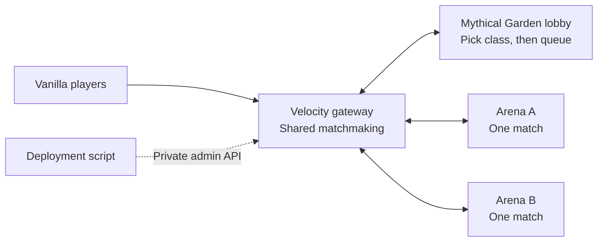

# Container network

The vanilla server now has a Velocity gateway, one Mythical Garden lobby and two independent arena workers. Players use ordinary Minecraft Java **26.2**, with no client mod or resource pack. Each arena runs one four-player match or one practice/sandbox session. The existing `PLAY.cmd` still runs the standalone prototype.



Velocity reserves an empty, healthy worker for the entire roster before moving anyone. A round starts only after every player reaches that worker. Each class selection travels with its reservation. Players return to the lobby after results or `/smash leave`. Incomplete public queues can wait while a free worker hosts training. Matchmaking excludes workers with stale HTTP responses or stalled game ticks.

## Start locally

Requirements: Docker with Linux containers, Docker Compose v2, Python 3.11+ and Java 25 for building. Run these commands **from this `smash_vanilla` directory**. On Windows use `gradlew.bat` and your Python executable; on Linux use `bash gradlew` and `python3`.

```powershell
$env:JAVA_HOME = 'C:\Program Files\Java\jdk-25'
./gradlew.bat --gradle-user-home ../smash_arena/.gradle-user-home build containerArtifacts
C:/Python312/python.exe deploy/prepare.py --secrets
docker compose build
docker compose up -d
C:/Python312/python.exe deploy/check.py
```

Join **localhost:25577** using your normal authenticated Minecraft launcher. The network does not start a client automatically. Production configuration authenticates accounts at Velocity; backends accept only Velocity's authenticated forwarding with a shared secret. The Docker setup contains the previously accepted Minecraft EULA setting.

The first boot downloads the pinned Minecraft/Fabric runtime and builds the maps. The lobby gets the garden; arena workers build only the battle stage. Each service has its own persistent Docker volume. The modded backup, modded save and standalone PLAY save are separate.

The gateway binds to loopback by default. For a public host, add these settings to `.env` and configure that host's firewall/DNS:

```dotenv
SMASH_BIND_IP=0.0.0.0
SMASH_PORT=25565
```

Only the gateway game port should be public. The admin port stays on **127.0.0.1:18080**; backend game/control ports are not published. Across hosts, use a private network/VPN for forwarding and control traffic. Modern forwarding requires the secret as well as network isolation; see [Velocity forwarding](https://docs.papermc.io/velocity/player-information-forwarding/) and [security](https://docs.papermc.io/velocity/security/).

`deploy/prepare.py --secrets` creates three separate random secrets without printing them. It preserves existing values. On Linux the secrets directory is private to its owner; individual files are readable inside their Docker bind mounts by the backend's unprivileged user. Do not commit this directory or `.env`. Images contain no secrets. For rotation, stop the network and replace the affected secret consistently on every service that uses it.

## Drain and update

```sh
python3 deploy/manage.py status
python3 deploy/manage.py drain arena-a
python3 deploy/manage.py resume arena-a
python3 deploy/manage.py roll arena-a --image ghcr.io/OWNER/REPO-backend@sha256:DIGEST
python3 deploy/manage.py roll arena-b --image ghcr.io/OWNER/REPO-backend@sha256:DIGEST
```

Replace the example image with a real release digest. Rollouts download the new image before draining, stop new assignments, wait for the current match and lobby transfers to finish, recreate only that arena, check its new boot ID and readiness, then resume matchmaking. The proxy holds the worker out of allocation throughout its restart. Sandbox users get a 30-second on-screen return notice; stock matches and practice finish normally. Repeating drain does not extend the sandbox deadline.

The default drain timeout is 660 seconds. If it expires, **the container is not stopped** and the worker remains drained; investigate or explicitly resume it. If a replacement fails readiness, the script restores the previous local image and checks it before resuming. A failed rollback stays drained. It does not restore world data; use compatible releases for rolling updates and take backups before migrations. Returning to an older compatible release uses the same `roll` command with its digest.

Successful rolls save `ARENA_A_IMAGE` or `ARENA_B_IMAGE` in `.env` so later Compose operations preserve the deployed version. For local images only, add `--local-image`. A local filesystem lock prevents overlapping deployments from this installation. After a deployment process crashes, verify it has stopped before removing the empty `deploy/.rollout-lock` directory.

The script supports an alternate project with `--project NAME` and extra Compose files with repeated `--compose FILE`, before the subcommand. Use `--no-persist` only for disposable tests. Remote administration should use SSH or an SSH tunnel, not a public admin port.

## CI/CD

Use **this directory as the Git repository root**. No GitHub repository or deployment host has been configured in this workspace yet.

`.github/workflows/network.yml` runs Java tests, builds both containers, starts an authenticated empty network, checks readiness and drain/resume, and saves diagnostics. Successful pushes to `main` publish two GHCR images tagged with the commit SHA. The `release-images` artifact and workflow summary contain immutable image digests. GitHub Actions are pinned to commits, container bases to digests, and Velocity/FabricProxy-Lite downloads to SHA-256 checksums.

`.github/workflows/deploy.yml` is a manually triggered deployment of a published backend digest. It rolls A and then B through SSH with host-key checking. Set these **production environment secrets**:

| Secret | Value |
|---|---|
| `SMASH_DEPLOY_HOST` | Hostname or IPv4 address |
| `SMASH_DEPLOY_USER` | SSH user with access to Docker and this installation |
| `SMASH_DEPLOY_PATH` | Absolute Linux path to this directory on the host |
| `SMASH_SSH_KEY` | Deployment private key |
| `SMASH_KNOWN_HOSTS` | Host key verified outside the workflow |

Bootstrap the host once with Docker/Python, this deployment directory, secrets and the running Compose network. Authenticate Docker on the host to pull private GHCR packages if necessary. The workflow does not upload server secrets or overwrite host configuration. GitHub's [container publishing documentation](https://docs.github.com/en/actions/tutorials/publish-packages/publish-docker-images) covers GHCR permissions and package visibility. The CI workflows must be activated and exercised in the actual repository before relying on them for production.

For the first container release, set `PROXY_IMAGE`, `BACKEND_IMAGE`, `ARENA_A_IMAGE` and `ARENA_B_IMAGE` to the appropriate immutable digests in `.env`, then run `docker compose up -d --no-build`. The three backend settings can initially use the same backend digest. Subsequent compatible arena updates use `manage.py roll`; updating the lobby's backend image or the proxy requires a maintenance window in this version.

## Scope and scaling

- **One proxy, one lobby, a static pool of two arena workers.** This demonstrates distributing whole matches and rolling arena updates. It does not provision extra containers automatically.
- The sample host budgets 2 GiB Java heap / 3 GiB container memory per backend and 512 MiB / 1 GiB for Velocity. These are starting limits, not measured public capacity. Benchmark real matches, tick time, CPU, memory and player latency before setting a player target.
- To add capacity, add a uniquely named arena service with its own volume and matching entry in `deploy/network.json`. This version loads the topology at proxy startup, and the rollout CLI explicitly supports A/B. Extending discovery and rollout management is a next step.
- The proxy owns the temporary global queue. A proxy restart disconnects players; a lobby restart interrupts players there. Gateway redundancy, multiple lobbies, durable profiles/results, parties, metrics, autoscaling and cross-region routing are not implemented.
- A crashed arena loses its current match. Velocity attempts to return connected players to the lobby, and reservations expire rather than blocking a worker indefinitely. Live matches cannot migrate between JVMs.
- Roll only releases compatible with Minecraft 26.2, the current proxy and control protocol 1. Protocol/Minecraft upgrades require coordinated maintenance.

## Developer validation

The headless `deploy/check.py` runs against normal authenticated Compose configuration and needs no client. The Windows end-to-end test uses **eight checksum-verified official clients**, a separate Docker project, and explicit loopback-only test overrides:

```powershell
docker compose -p smash-network-test -f compose.yaml -f deploy/compose.smoke.yaml up -d --no-build
C:/Python312/python.exe deploy/network_smoke.py
./gradlew.bat --gradle-user-home ../smash_arena/.gradle-user-home runClientGameTest -PnetworkTests
docker compose -p smash-network-test -f compose.yaml -f deploy/compose.smoke.yaml down
```

The stock test checks two disjoint rosters, drain admission, return to lobby, and replacement of A while B continues. The separate native-input harness checks class picking, camera handoff, movement and leaving/rejoining through Velocity. This harness uses Fabric testing code; the stock-client check establishes unmodified-client compatibility. Do not use `compose.smoke.yaml` on a public host: it explicitly enables offline test identities, automatic class selection and private test controls. Never expose its ports beyond loopback. Eight rendered clients need substantial local graphics resources.

Standalone gameplay regression:

```powershell
./gradlew.bat --gradle-user-home ../smash_arena/.gradle-user-home build runClientGameTest -PdedicatedTests
```
